# Three Oracles, One Transformer

*A walk through GPT-2, with a notebook you can run without editing code*

I put three Oracles into one sentence:

> At Oracle Park, Trina asked the old oracle whether Oracle Linux would boot before the database demo.

A ballpark, someone to ask for a prophecy, and an operating system. The repetition is deliberate. I wanted one sentence that would give us something interesting to follow through tokenization, embeddings, attention, and finally a prediction.

Stop at **would**. What comes next?

GPT-2 chooses **be**, at about **27.32%**. My word, **boot**, comes in at **rank 167**, with about **0.052%**.

Rank 167 is a long way down for the word I built the sentence around. And yet Linux has a perfectly recognizable neighborhood in the same model's embedding table: Ubuntu, Unix, Debian. How do we get from that neighborhood to a prediction that heads somewhere else?

That's the thread I want to follow. Each part of the model does a particular job, then leaves something for the next part to do. The notebook lets us stop along the way and look at the actual numbers.

## Before we start

The [companion notebook](https://github.com/Trina0224/LLMdesu/blob/main/notebooks/transformer_one_sentence_en.ipynb) runs a trained GPT-2 small: **12 layers, 12 attention heads per layer, 768 coordinates per token state**. I chose it because we can open it up and follow the calculations on an ordinary Colab runtime.

[Open it in Colab](https://colab.research.google.com/github/Trina0224/LLMdesu/blob/main/notebooks/transformer_one_sentence_en.ipynb) and run the cells from top to bottom. You don't need to edit Python. I'll point out a few places worth lingering over; the existing examples already contain the comparisons we need.

We'll use the sentence in two ways:

| Experiment | Input | What we're looking at |
| --- | --- | --- |
| Inspect the sentence | All 21 tokens, with a causal mask | States and attention at each position |
| Continue the sentence | The prefix ending in `would`, positions 0–14 | What the model predicts next |

Even when the full sentence is present, GPT-2's state at any position can use only that position and the ones before it.

## 1. How far back can a model look?

Start with something simple: count which words follow which other words.

A bigram model uses the last word to predict the next one. In Section 1 of the notebook, two prefixes about different subjects both end in `would`. The little counting model gives them the same continuation statistics. Everything before that last word has dropped out of its decision.

We could count longer sequences. But the number of possible combinations grows quickly, and many will be rare or absent from the training data.

An RNN carries a state forward through the sentence. An LSTM adds gates to control what its memory keeps, writes, and exposes. Earlier information can travel a long way through that state, though each recurrent step still depends on the one before it.

Attention gives us another route: a position can take a weighted mixture of representations from accessible positions. A distant source can contribute directly within an attention layer. Attention appeared in recurrent translation systems before the Transformer; the Transformer built its sequence processing around attention and feed-forward layers. [Bahdanau et al.](https://arxiv.org/abs/1409.0473), [Vaswani et al.](https://arxiv.org/html/1706.03762v7#S4)

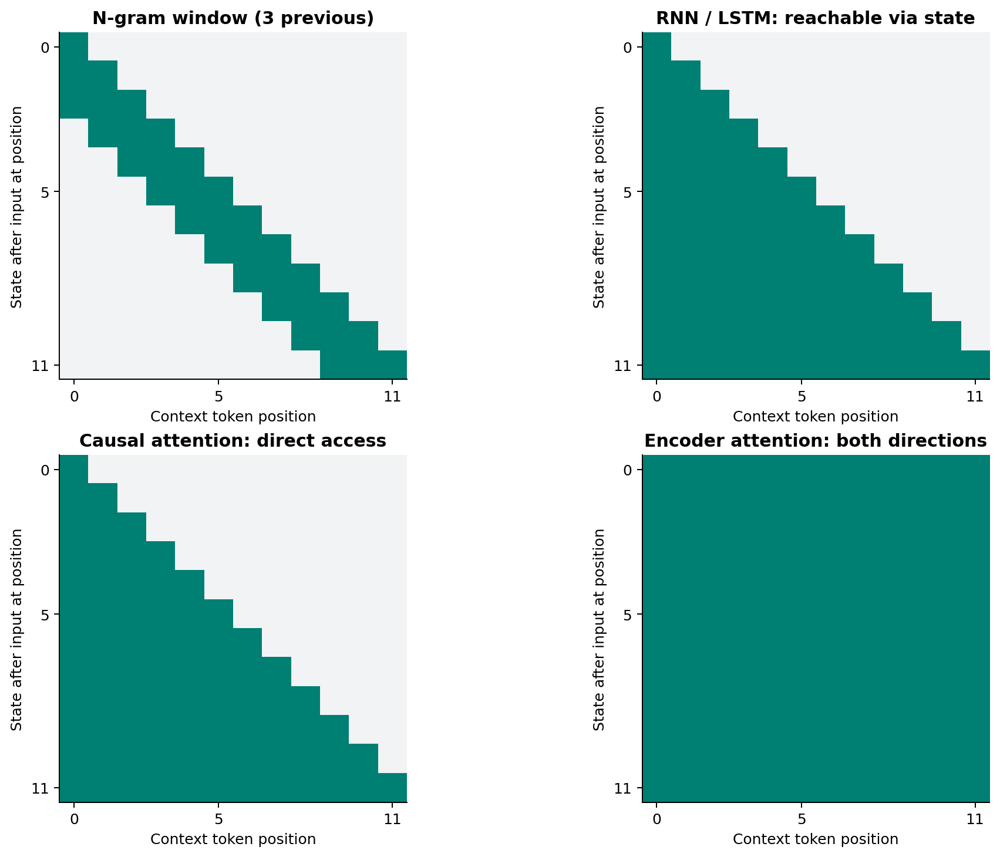

*Figure 1. Each row shows the context available after processing an input position. These are structural illustrations, not measured attention weights. The window diagram uses three tokens; the notebook's counting example is a bigram.*

The RNN/LSTM and causal-attention panels have the same triangular shape. In the RNN/LSTM diagram, earlier information reaches the current position through a chain of state updates. In causal attention, the layer can read the earlier representations directly.

This also changes what can run in parallel. For a known input sequence, self-attention can process all its query positions together within a layer. Generating new text still has a dependency: choose a token, then use it to predict the next one.

There's a price for all those connections. Dense attention creates a score for every query–key pair. Double the sequence length and there are four times as many scores per head.

## 2. What happened to my words?

### Twenty-one pieces

GPT-2 uses byte-level byte-pair encoding, or BPE. The tokenizer turns our sentence into **21 tokens**, numbered 0 through 20.

Some of those pieces are whole words. Others are less tidy.

| Position | Decoded token | Token ID |
| --- | --- | --- |
| 1 | `[sp]Oracle` | 18650 |
| 4–5 | `[sp]Tr` / `ina` | 833 / 1437 |
| 9–10 | `[sp]or` / `acle` | 393 / 6008 |
| 12 | `[sp]Oracle` | 18650 |
| 13 | `[sp]Linux` | 7020 |
| 14 | `[sp]would` | 561 |
| 15 | `[sp]boot` | 6297 |

Here `[sp]` means a leading space. My name gets split into ` Tr` and `ina`. The lowercase ` oracle` becomes ` or` and `acle`, while both capitalized occurrences of ` Oracle` get the same ID: 18650.

So even before we reach the model, “compare the three Oracles” is a more complicated request than it sounds.

I also included AMD in the tokenizer examples. `AMD` gets ID 28075; ` AMD`, with a leading space, gets 10324. Both are single tokens. The space changes which entry we're dealing with.

Section 3 shows the full token table. It's worth finding positions 14 and 15 now. We'll keep coming back to them.

### One ID, one row

The embedding table contains a learned vector for each token ID:

$$
E\in\mathbb{R}^{50257\times768},\qquad e_p=E_{x_p}.
$$

Here $x_p$ is the token ID at position $p$. The lookup returns 768 numbers. For the whole sentence, the shape is **1 × 21 × 768**: one sequence, 21 positions, 768 coordinates at each position.

Those values were learned during training. Features are spread across coordinates; there isn't a dedicated “operating system” column that we can read off.

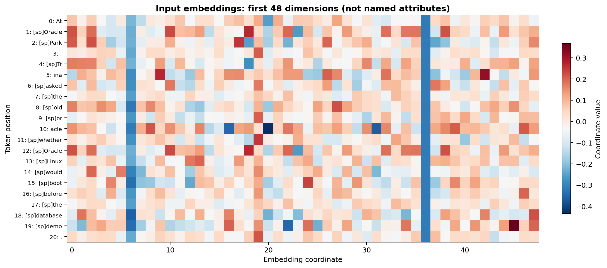

*Figure 2. Rows are token positions, columns are embedding coordinates, and color shows the signed value. Look at rows 1 and 12: the same Oracle ID produces the same row of numbers.*

At this stage, Oracle before Park and Oracle before Linux really do start with the same token vector. The model still has to build a representation for each occurrence.

### Linux has neighbors

Before adding the sentence back in, let's spend a moment with the embedding table itself.

We can compare two rows with cosine similarity:

$$
\operatorname{cos}(u,v)=\frac{u\cdot v}{\lVert u\rVert\lVert v\rVert}.
$$

For the query ` Linux`, these are the first eight results. The search uses all 768 coordinates, excludes the query itself, and keeps the notebook's wordlike-token filter enabled.

| Rank | Neighbor | Cosine |
| --- | --- | ---: |
| 1 | `Linux` | 0.772 |
| 2 | `[sp]linux` | 0.725 |
| 3 | `[sp]Ubuntu` | 0.635 |
| 4 | `[sp]Unix` | 0.630 |
| 5 | `linux` | 0.627 |
| 6 | `[sp]Windows` | 0.606 |
| 7 | `[sp]GNU` | 0.594 |
| 8 | `[sp]Debian` | 0.585 |

The first two neighbors are spelling and spacing variants. Then come familiar operating-system names. Both kinds of relationship live in this learned space.

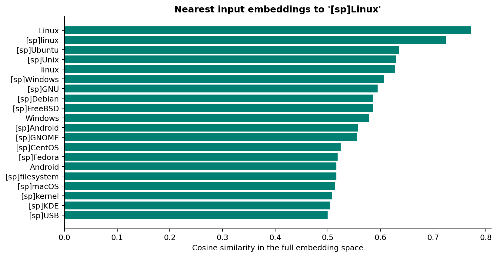

*Figure 3. Linux's neighborhood, ranked by cosine similarity across all 768 coordinates.*

I like this as the first visual stop. A table of thousands of numbers starts to look connected to words we recognize.

We can also project a selection of vectors onto a plane:

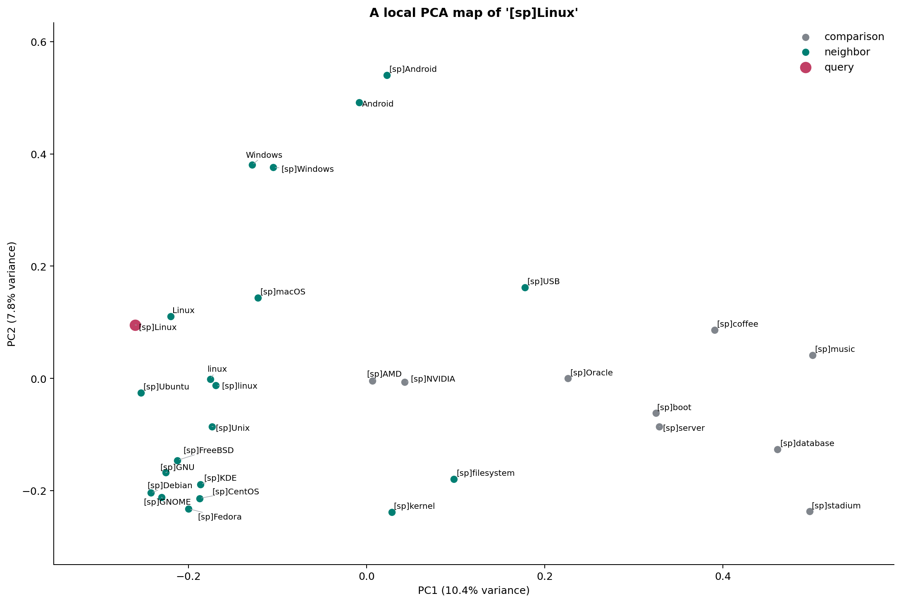

*Figure 4. Red is the query, green marks retrieved neighbors, and gray marks comparison tokens I included. The two PCA axes retain about 18.2% of the variation in this selected set: 10.4% plus 7.8%. Use the full-dimensional ranking above when you want to know which vectors are closest.*

AMD and NVIDIA are gray because they're comparison points. I included them to give the map some familiar landmarks. The axes are computed projection directions, so the map's left and right don't have predefined meanings.

The neighbor table in Section 4.2 is the part to come back to when the picture gets tempting.

### Same token, different place

Now compare:

> Trina asked the old oracle.  
> The old oracle asked Trina.

The participants have swapped roles. Their token embeddings alone can't tell us where they appeared.

GPT-2 adds a learned position vector:

$$
h_p^{(0)}=E_{x_p}+P_p.
$$

Both terms have 768 coordinates, so the sum still has 768. The next layer now receives a state shaped by both identity and position.

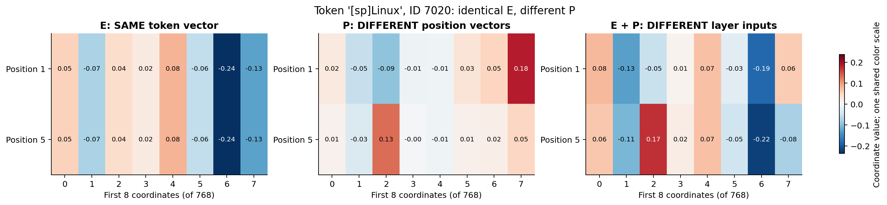

*Figure 5. Hold the Linux token vector fixed and try positions 1 and 5. The left panel stays the same; the middle panel changes; the right panel shows the resulting inputs. All three panels share a color scale.*

These are controlled placements for the comparison. In our actual sentence, Linux is at position 13.

Pick one column and follow the addition across the three panels. That's the whole operation. Learning how to use this position information comes later, through the model's weights.

GPT-2 learns its absolute position vectors. The original Transformer used sine/cosine position encodings; Section 5 displays both. [Original Transformer, Section 3.5](https://arxiv.org/html/1706.03762v7#S3.SS5)

There's also a small experiment with position information and the causal mask both removed. Swapping input rows swaps output rows correspondingly: attention follows the rearrangement. GPT-2 adds explicit position vectors and a directional mask to that basic computation.

We have a token and a place. Now it needs context.

## 3. Follow one row of attention

For this part, stay with **position 15, ` boot`**, in the first layer's first head.

Trying to read the entire attention matrix at once is a good way to get lost. One row is enough to see the mechanism.

### Q, K, and V

GPT-2 first normalizes the incoming state. For the first block, write $Z=\operatorname{LN}_1(H^{(0)})$. One head projects it three ways:

$$
Q=ZW_Q+b_Q,\qquad K=ZW_K+b_K,\qquad V=ZW_V+b_V.
$$

The roles are easiest to remember through the work they do. Q is used by a receiving position to find matches. K supplies the features it matches against. V carries the content that will be mixed.

Matching and content needn't use the same features. Giving them separate projections lets the model learn how to choose a source separately from what that source contributes.

The projection weights are shared across positions within the head. Each token supplies a different state to the same transformations. We're using already-trained weights throughout this walkthrough; Q, K, and V are the values computed from the current input.

For one GPT-2 small head, each has shape **21 × 64**, leaving out the batch dimension. Q multiplied by K's transpose produces **21 × 21** scores: receivers down the rows, source positions across the columns.

### Scores, mask, mixture

The attention equation gives us three operations:

$$
S=\frac{QK^\top}{\sqrt{d_k}},\qquad
A=\operatorname{softmax}_{\mathrm{key}}(S+M),\qquad
O=AV.
$$

First, calculate the dot-product matching scores and scale them. Here $d_k=64$, so we divide by $\sqrt{64}=8$. The scaling keeps the scores from growing too large and making softmax excessively sharp.

Then apply the causal mask:

$$
M_{ij}=\begin{cases}0,&j\leq i,\\-\infty,&j>i.\end{cases}
$$

Future positions get $-\infty$. After softmax, their weights are zero. The allowed positions get nonnegative weights that sum to one across the row.

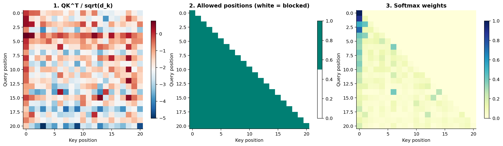

*Figure 6. Follow a row from left to right: matching scores, permitted positions, mixing weights. The blank upper triangle in the middle panel becomes zero weight on future positions.*

Finally, use those weights to combine the value vectors:

$$
o_i=\sum_{j=0}^{i}A_{ij}v_j.
$$

For a tiny numerical example, take three value vectors: $(2,0)$, $(0,4)$, and $(2,2)$. Give them weights 0.5, 0.3, and 0.2. The mixture is $(1.4,1.6)$.

That's what the last matrix multiplication does, with more coordinates and values learned by the model.

Here's the actual boot row:

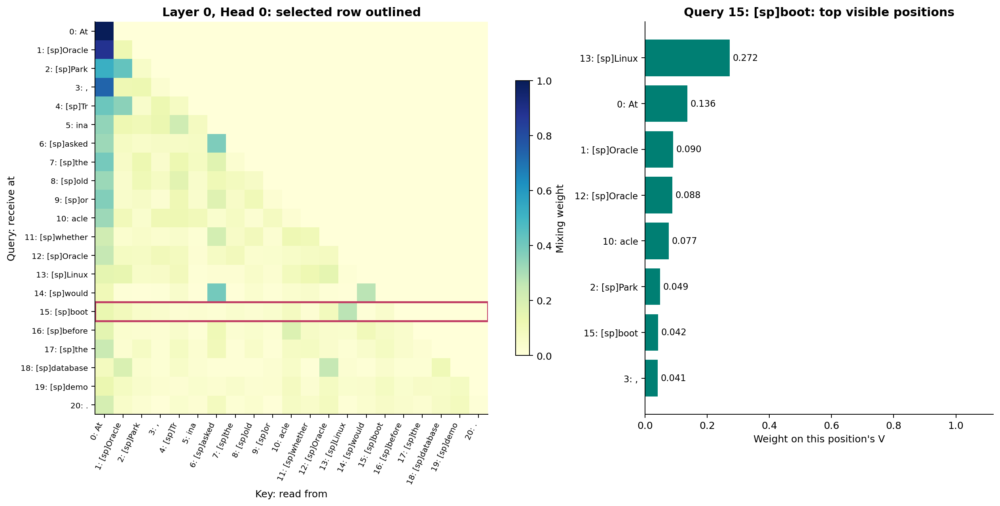

*Figure 7. Layer 0, head 0, query 15: boot. Linux at position 13 receives about 0.272 of the mixing weight. The chart on the right pulls out the eight largest entries in the highlighted row.*

So the output contains a contribution of approximately **0.272 times Linux's value vector**. Other positions supply the rest. The output projection and subsequent layers then process the combined result.

Open Section 9.2 and this boot row is already selected for you. Section 8.2 also shows a single row, but its default is the final punctuation token, which explains why its table looks different.

### The one-position trap

There's something easy to miss in that picture.

**Boot is already in the input.**

We're watching what happens at position 15 after the model receives it. That position's state will predict the *following* token, `before`, in our written sentence.

To ask whether the model would predict `boot`, we need position **14**, `would`.

| Where we look | Last token already received | Next token in the written sentence |
| --- | --- | --- |
| Position 14 | `would` | `boot` |
| Position 15 | `boot` | `before` |

This is why the prominent Linux weight in Figure 7 and boot's low next-token ranking can coexist. They describe different computations at different positions. An attention coefficient tells us how a head mixes V; a vocabulary probability tells us what the model might output next.

### Twelve heads

One head gives us one learned matching-and-mixing pattern. GPT-2 small runs twelve, each producing 64 coordinates, then concatenates and projects their outputs:

$$
\operatorname{MHA}(Z)=\operatorname{Concat}(O_1,\ldots,O_{12})W_O+b_O.
$$

Twelve times 64 brings us back to 768. We still have 21 token positions.

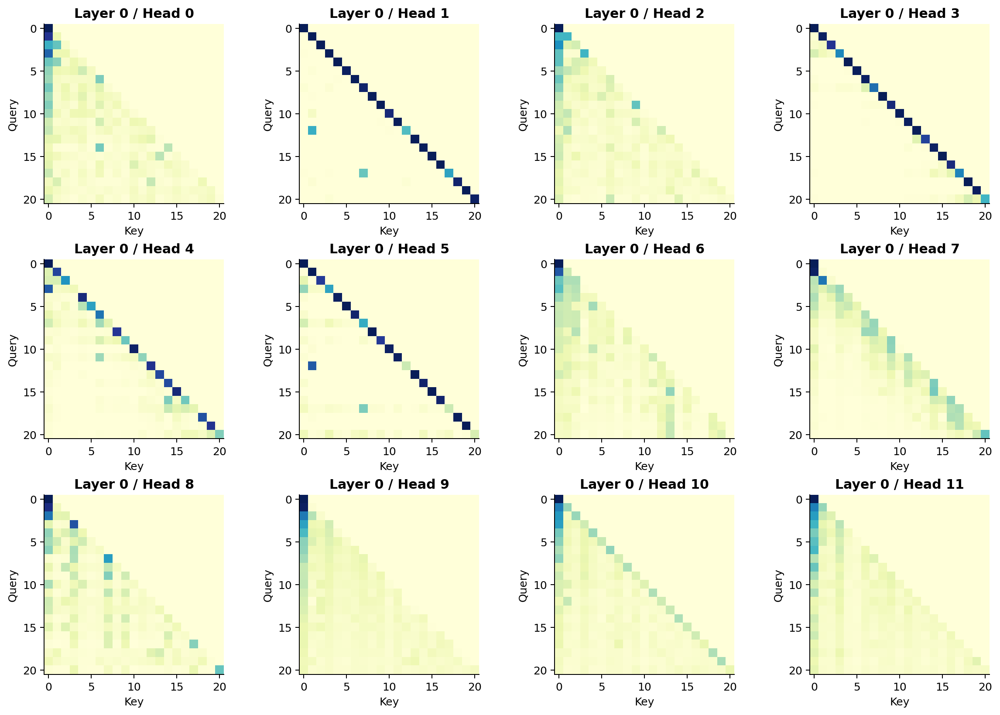

*Figure 8. Same sentence, same layer, twelve heads. Compare one row across the panels. Several heads concentrate on the diagonal; others spread more weight over earlier positions.*

These are different learned projections operating within one layer. A layer is a round of processing; a head is one of the parallel computations inside that round. The grid puts those different patterns side by side.

## 4. What happens after attention?

### Add the update

A GPT-2 block takes its incoming state $X$ through two updates:

$$
U=X+\operatorname{MHA}(\operatorname{LN}_1(X)),
$$

$$
Y=U+\operatorname{MLP}(\operatorname{LN}_2(U)).
$$

The first line normalizes a view of X, computes an attention update, and adds that update back to X. The second does the same with an MLP, also called a feed-forward network.

This running state is the residual path. Each sublayer gets to add something to it. Keeping the width at 768 makes those additions fit.

GPT-2 uses **pre-norm**: normalize before each sublayer. It also has a final LayerNorm after the block stack. [GPT-2 report, Section 2.3](https://cdn.openai.com/better-language-models/language_models_are_unsupervised_multitask_learners.pdf)

### Why expand to 3072?

The MLP works on each position's features:

$$
\operatorname{MLP}(z)=\operatorname{GELU}(zW_1+b_1)W_2+b_2.
$$

Its widths go **768 → 3072 → 768**.

The first projection forms a larger set of intermediate features. GELU changes their responses nonlinearly. The second projection combines the result into a 768-coordinate update that can be added back to the residual path.

The nonlinearity matters. A chain of affine transformations could otherwise collapse into one affine transformation, however many intermediate coordinates we used.

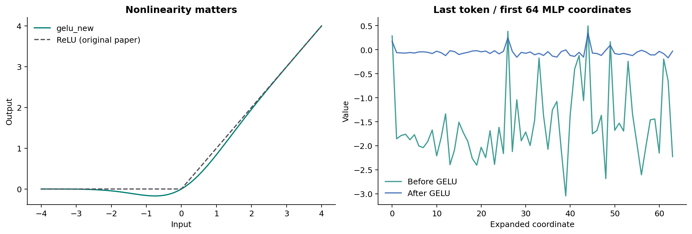

*Figure 9. Left: the activation functions. Right: the first 64 expanded MLP coordinates at the sentence's final position, before and after GELU. GPT-2 uses a GELU variant; the original Transformer used ReLU.*

Attention mixes across positions. The MLP processes features within each position, with the same weights applied at every position in a layer. Its input already carries the effects of attention.

Section 10 has a neat check: change the MLP input at one position, and the outputs at the other positions stay the same. It makes the distinction visible in a way the formula alone doesn't.

### The shortcut through depth

For $y=x+F(x)$, differentiation gives:

$$
\frac{\partial y}{\partial x}=I+\frac{\partial F}{\partial x}.
$$

The identity term is the direct path introduced by the addition.

The notebook uses a deliberately simple scalar example: $F(x)=-0.1x$. Repeating F for L layers gives a derivative magnitude of $0.1^L$. With the residual addition, each layer is $x+F(x)=0.9x$, giving $0.9^L$.

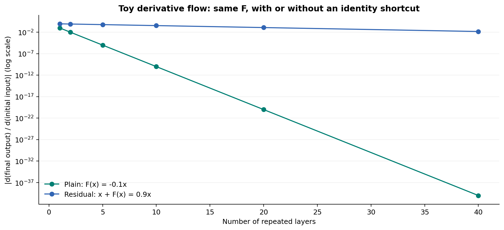

*Figure 10. At depth 20, the derivative magnitude is about $10^{-20}$ without the shortcut and 0.122 with it. This is a toy derivative experiment, not a measurement of GPT-2 training gradients. The vertical axis is logarithmic.*

That's a large difference from one extra addition. Both curves still fall, but at very different rates.

It also helps separate two ideas: loss scores a prediction against a target; a gradient tells us how sensitive that score is to a change in an input or parameter. Residual connections change the routes through which derivatives propagate.

LayerNorm handles feature scale. For each token, it computes statistics over that token's coordinates, then applies learned scale and bias:

$$
\operatorname{LN}(x)=\gamma\odot\frac{x-\mu(x)}{\sqrt{\sigma^2(x)+\epsilon}}+\beta.
$$

The learned $\gamma$ and $\beta$ can shift the final mean and scale away from zero and one. The operation stays within the position's feature vector.

Put these pieces together and we have a block that gathers information, transforms features, and adds updates to an ongoing state. Repeat the block twelve times, with different learned weights at each layer, and each round works on what the previous rounds have built.

Section 11 contains both the toy derivative plot and a plot of GPT-2 vector magnitudes. Their vertical axes tell you which quantity you're looking at.

## 5. Change the ending. What moves?

The two capitalized Oracle tokens start with identical input embeddings. After position information and several blocks, their states can differ.

But how much of the sentence can each occurrence actually use?

The first Oracle, at position 1, can see `At` and itself. Park is still ahead. The later Oracle, at position 12, can see its prefix, but Linux at position 13 is still ahead too.

The state at Linux can combine Linux with the Oracle before it. That information doesn't travel backward to revise the earlier Oracle state.

### The result that stays the same

Section 13.2 puts that rule to the test with these two inputs:

> At Oracle Park, Trina asked the old oracle whether Oracle **Linux would boot before the database demo.**

> At Oracle Park, Trina asked the old oracle whether Oracle **announced a concert at the stadium.**

Same prefix, quite different endings.

The notebook verifies that the shared prefix has identical token IDs, then compares its hidden states across the layers. The future-invariance check passes: differences remain within the small floating-point tolerance.

Nothing much happens to the prefix. That's exactly what should happen.

At every layer, attention reads the same permitted prefix. The MLP and LayerNorm work within each position. The residual additions combine those results. There's no path for the changed ending to come back through.

This is one of my favorite examples in the notebook because a nearly unchanged output tells us so much about the architecture. Putting the entire sentence in the input array doesn't make the entire sentence available at every position.

### Boot, meet boot

Here's the less cooperative experiment. Take four sentences ending in the same token:

> Oracle Linux would boot  
> The server failed to boot  
> She was wearing a boot  
> He had lost one boot

The last token has the same ID in all four, so its input embedding is identical. After the model processes the different prefixes, the final states differ.

I'd love a clean picture here: two startup examples together, two footwear examples together. Instead, we get this:

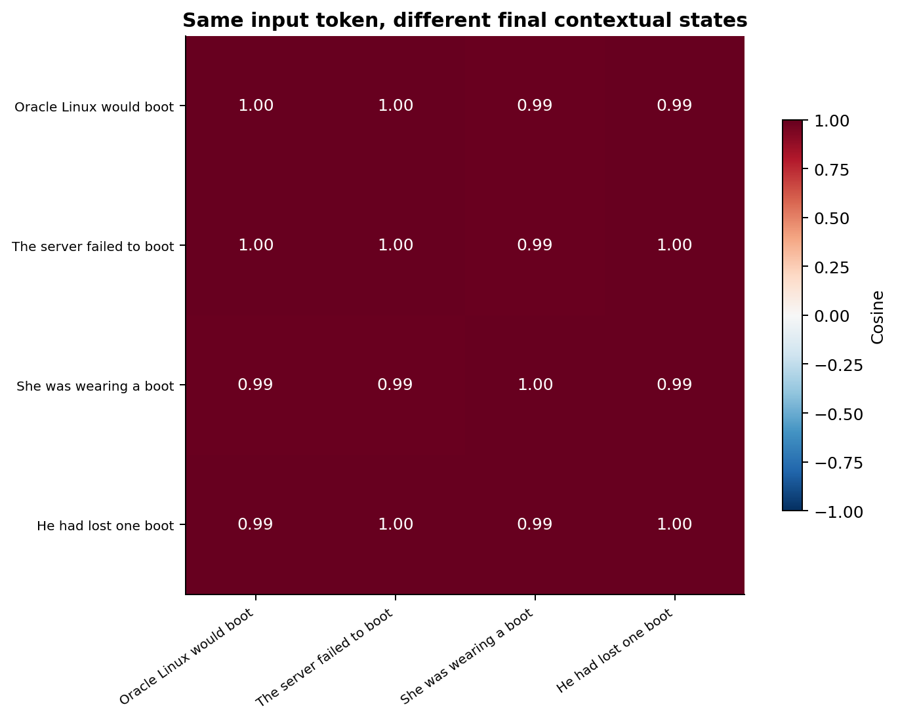

*Figure 11. Each row and column is one sentence's final boot state. The off-diagonal similarities range from about 0.986 to 0.998. Rounded to two decimals and drawn on this color scale, most of the heatmap looks almost identical.*

One dark red square. The CSV is more revealing than the picture.

The two startup examples score about **0.9976**. The two footwear examples score **0.9931**. But “The server failed to boot” paired with “He had lost one boot” scores **0.9954**—higher than the footwear pair.

So I can't draw a tidy line between shoes and startup from these numbers.

The states do change with the occurrence. This particular cosine comparison just doesn't sort the meanings the way we might hope. The sentences also differ in position and syntax, which is why a larger, more controlled set of examples would be the next experiment.

I kept this figure because it interrupts an overly easy story: turn words into vectors, add context, and meaning becomes a neat cluster. Sometimes the plot is a big red square and you have to read the numbers.

Start with the unchanged-prefix example in Section 13.2, then look at this comparison in 13.3. One gives a clear test of the causal structure; the other opens a messier question about what a representation captures.

## 6. Why is boot ranked 167th?

### Back to the vocabulary

After the last block and final LayerNorm, each position still has 768 coordinates. The language-model head turns that state into a score for every vocabulary token:

$$
\operatorname{logits}_t=h_t^{\mathrm{final}}E^\top,\qquad
p(x_{t+1}\mid x_{\leq t})=\operatorname{softmax}(\operatorname{logits}_t).
$$

GPT-2 shares the embedding table with this output projection. On the way in, a token ID selects one row. On the way out, the processed state is scored against all the rows.

For the full sentence, the shape changes from **1 × 21 × 768** to **1 × 21 × 50,257**. For our prefix ending in `would`, we read the last position's distribution.

The name “head” shows up twice here. The LM head is the vocabulary-output layer. Attention heads are the matching-and-mixing computations inside the blocks.

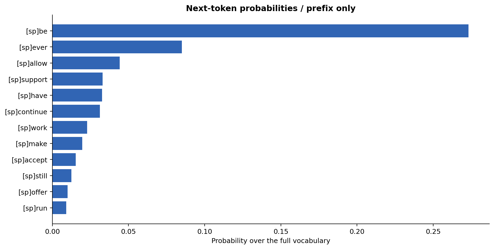

*Figure 12. The twelve leading candidates after would. Be takes 27.32%, ever 8.51%, and allow 4.43%.*

And here's where some of the continuations I was interested in actually land:

| Candidate token | Rank | Probability |
| --- | ---: | ---: |
| `[sp]be` | 1 | 27.318% |
| `[sp]work` | 7 | 2.285% |
| `[sp]run` | 12 | 0.920% |
| `[sp]start` | 47 | 0.276% |
| `[sp]boot` | 167 | 0.052% |

By now we can see why Linux having sensible neighbors doesn't require boot to win. The model has processed a whole prefix through twelve layers and scored the resulting state against the vocabulary. Being close to Linux in the input table never entered the calculation as a rule saying which word must come next.

There's also a piece of context that *we* have and the prediction doesn't: `before the database demo`. It comes after the stopping point. In Section 14.3, I put that information before `would` in a separate prompt. The candidate distribution changes.

Here's the table I'd keep beside the plots:

| Measurement | What is being compared or distributed? | Meaning of a larger value |
| --- | --- | --- |
| Embedding cosine | Two token vectors from the input table | More similar directions in that space |
| Attention weight | Source positions for one query in one head | A larger coefficient on that source's V in the weighted sum |
| Next-token probability | Candidate token IDs in the vocabulary | More probability assigned to that continuation |

Notice that the attention equation uses a scaled dot product between projected Q and K, while the neighbor search uses cosine between input embeddings. Even their similarity calculations use different objects.

### Let it keep writing

The saved run uses greedy decoding: take the highest-probability token, append it, and calculate the next distribution.

| Step | Selected token | Model probability | New ending |
| --- | --- | ---: | --- |
| 1 | `[sp]be` | 27.32% | `would be` |
| 2 | `[sp]available` | 9.32% | `would be available` |
| 3 | `[sp]for` | 20.32% | `would be available for` |
| 4 | `[sp]the` | 10.46% | `would be available for the` |

The first completed sentence is:

> At Oracle Park, Trina asked the old oracle whether Oracle Linux would be available for the first time.

GPT-2 has taken the sentence somewhere else. It commits to `be`, then predicts from that new prefix.

Greedy decoding can make a definite choice from a fairly uncertain distribution. At step 2, the winner has just 9.32%. The trace's “selection probability” is 1 because the greedy rule always picks the winner; “raw model probability” records its actual share of the distribution.

Sampling draws from the distribution instead. Temperature rescales the logits; sampling top-k restricts the candidate pool before renormalization. In this saved greedy run, those two sampling settings aren't used.

The notebook recomputes the growing prefix each time so the loop is easy to follow. A KV cache can reuse earlier keys and values. Remember the unchanged-prefix experiment? Appending new tokens leaves those earlier representations alone, which is why they can be reused.

### Where the learning signal comes from

For training, we know the actual next tokens in the written sentence. We can compare each prediction with its target:

| State used | Prefix ends in | Target |
| --- | --- | --- |
| Position 13 | `Linux` | `would` at position 14 |
| Position 14 | `would` | `boot` at position 15 |
| Position 15 | `boot` | `before` at position 16 |

This one-position shift is why a token is allowed to attend to itself. The state at would has received would; its target is boot.

For T tokens, the notebook averages the negative log probabilities over T−1 targets:

$$
\mathcal{L}=-\frac{1}{T-1}\sum_{t=0}^{T-2}\log p(x_{t+1}\mid x_0,\ldots,x_t).
$$

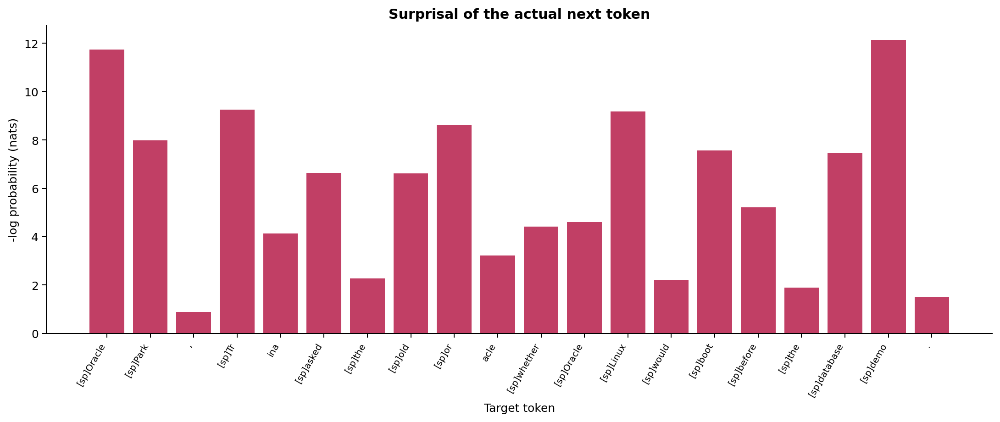

*Figure 13. Each bar is labeled by its target token. Boot's bar is about 7.567 nats, corresponding to its roughly 0.000517 probability after would. The average over all twenty targets is about 5.879 nats.*

There's our rank-167 result again, now expressed as a loss contribution.

All the targets can be scored in one forward pass. The actual preceding tokens are supplied as inputs, and the causal mask blocks future information. This training arrangement is called teacher forcing.

Backpropagation would then compute gradients, and an optimizer would update the embeddings, projections, MLPs, and other parameters. In the notebook, we calculate the loss and check it against the model's result, keeping the weights fixed.

Sections 14–16 connect these views. The candidate table gives boot a probability; the loss plot takes its negative logarithm; the generation trace shows what happens when the model chooses its own continuation instead.

## 7. Now open the architecture diagram

I saved the full diagram until this point. We've already followed the work behind most of its boxes.

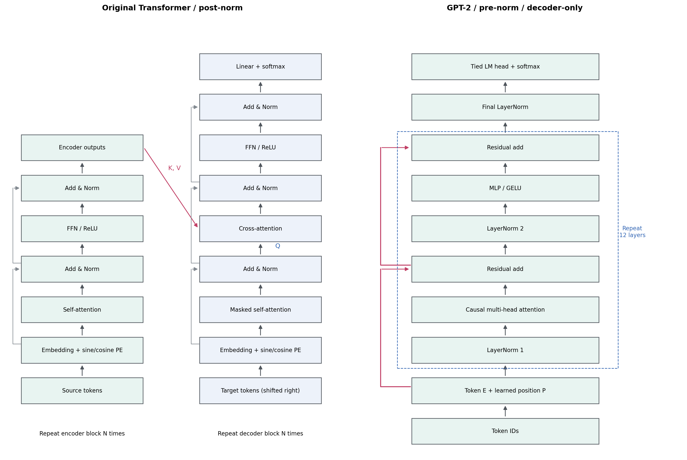

*Figure 14. Read upward. GPT-2 is on the right; the dashed region repeats twelve times. The original encoder-decoder layout is on the left. The side paths carry residual additions.*

On the GPT-2 side, start with the IDs and trace the route we've just taken: token and position vectors, normalized inputs to attention and MLP, residual additions, final normalization, vocabulary scores.

The original Transformer adds an encoder for the source text and cross-attention in the decoder. In translation, the decoder can refer to the encoder's representation of the source while writing the target. Its Q comes from the decoder; K and V come from the encoder outputs. The future *target* tokens are still hidden by causal self-attention. [Original Transformer, Section 3.2.3](https://arxiv.org/html/1706.03762v7#S3.SS2.SSS3)

GPT-2 has no separate encoder or cross-attention in this path. There are smaller differences too: learned positions, pre-norm, and a GELU variant, compared with sinusoidal positions, post-norm, and ReLU in the original diagram.

Section 17 has a small random-weight example with three queries and five source positions. Its **3 × 5** attention matrix is a quick way to see why the decoder and source don't have to be the same length.

### What if the model could look right?

BERT gives us that comparison. Place a mask inside the sentence:

> At Oracle Park, Trina asked the old oracle whether Oracle Linux would [MASK] before the database demo.

BERT can use the words on both sides to fill the masked position. The `[MASK]` token marks the missing content; GPT-2's causal mask controls which positions attention may read. [BERT paper](https://aclanthology.org/N19-1423/)

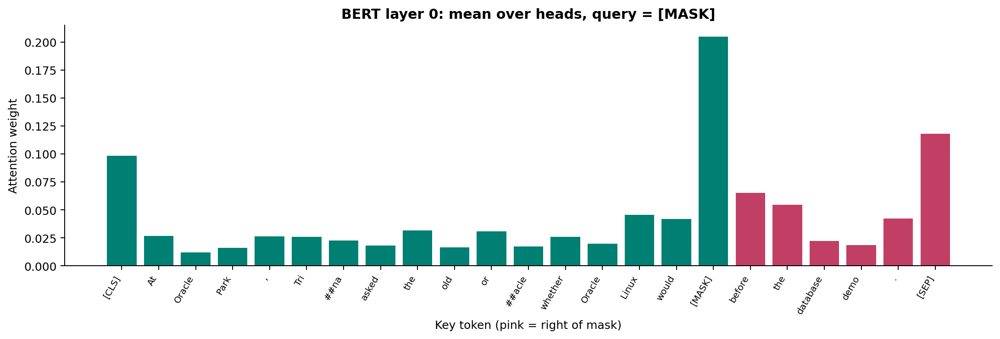

*Figure 15. First-layer attention from BERT's masked position, averaged across heads. The pink bars show it reading positions to the right, including before, the, database, and demo.*

In the saved fill-in results, `appear` leads with about **8.58%**. Replace the right-hand text with `on the old laptop`, and `work` leads with about **53.65%**.

That change can affect BERT right at the masked position. In our GPT-2 shared-prefix experiment, changing the suffix couldn't reach backward. The two architectures give information different routes through the sentence.

BERT is the optional experiment in Section 18. The screenshot comes from my run with it enabled; you can finish the main GPT-2 route without downloading the extra model.

## 8. Back to the sentence

My original question was what a real model would do with three Oracles. Along the way, even the apparently simple parts turned out to have something worth checking: lowercase oracle breaks into two tokens, the capitalized Oracle occurrences start from the same row, and Linux's neighbors include spelling variants before we get to Ubuntu.

The part I'd most like you to try is the timing comparison. Look at boot's attention row, then look at the prediction made at would. Once those are separate in your head, the causal mask, the shifted target, and the generation loop fit together.

And keep the uncooperative results. Boot at rank 167 is useful. So is the nearly solid-red cosine plot. They give us better questions to ask of the next experiment.

Next I want to poke at [retrieval-augmented generation](https://arxiv.org/abs/2005.11401): give the model a few useful documents before it starts writing and see what changes.

For now, there's plenty inside this one sentence. [Open the notebook](https://colab.research.google.com/github/Trina0224/LLMdesu/blob/main/notebooks/transformer_one_sentence_en.ipynb), run it, and start with whichever result made you want to look twice.

## Files and run details

I didn't rerun anything for this article; every number here comes from the archived run. All fifteen figures come from [transformer_lab_outputs.zip](https://github.com/Trina0224/LLMdesu/blob/main/results/transformer_lab_outputs.zip).

The run used `openai-community/gpt2`, revision `607a30d783dfa663caf39e06633721c8d4cfcd7e`, with float32, eager attention, CUDA, seed 42, and Transformers 4.57.6. All **13 checks passed**, including the attention reconstruction, first-block reconstruction, future-invariance test, and shifted loss. The notebook can also run on CPU.

The article package includes `assets/` for the PNGs and `data/` for the exported tables and settings. If you want to check a number, start with the [tokens](data/03_tokens.csv), [Linux neighbors](data/04_embedding_neighbors.csv), [selected attention weights](data/08_query_weights.csv), [boot comparisons](data/13_boot_pairs.csv), [candidate probabilities](data/14_candidate_tokens.csv), [loss values](data/15_shifted_loss.csv), or [checks](data/checks.json).
